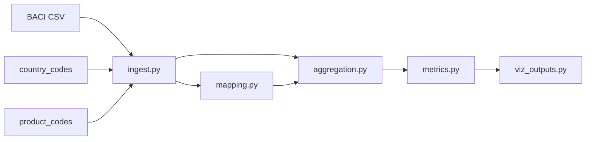

# Coercion Exposure Index – Trade Network Lens (BACI HS02)

This repo builds a **Coercion Exposure Index (CEI)** from raw **CEPII BACI HS02** trade data.

The CEI is a **directed** measure of how much one country can, in principle, coerce another **via trade dependencies** in a given sector and year.

Under the hood, it uses:

- **Import exposure** (how vulnerable a country is in a sector),
- **Export leverage** (how much others depend on you),
- **Network centrality** (how central you are in the trade graph),
- **Replaceability** (how easily a target can swap out its top suppliers).

You can:

- compute CEI edges for any year/sector,
- view them as a **directed graph SVG** (who can hurt whom),
- and feed the underlying metrics into your own SVGs, maps, or React/3D components.

---

## What you have right now

- A Python package under `pipeline/` that:
  - loads BACI + code tables,
  - aggregates HS6 → HS2 → sectors,
  - computes dependency metrics and composite indices,
  - produces visualization-ready tables,
  - and, via `pipeline.coercion`, computes **coercion exposure scores** for each ordered country pair.
- A `tests/` suite that validates the math and data consistency at each stage.

- A ready-to-run script [`main.py`](main.py) that:
  - runs the full pipeline for a chosen `YEAR` and `SECTOR`,
  - computes CEI edges,
  - writes a `coercion_edges_*.csv`,
  - and saves a directed **coercion network SVG**.

---

## Data files (inputs)

Place these three files in the **project root**:

- `BACI_HS02_Y2024_V202601.csv`
  - Columns (per BACI readme):
    - `t`: year
    - `i`: exporter (numeric code)
    - `j`: importer (numeric code)
    - `k`: product (HS6, numeric)
    - `v`: value (**thousand USD**)
    - `q`: quantity (metric tons)
- `country_codes_V202601.csv`
  - Columns:
    - `country_code`, `country_name`, `country_iso2`, `country_iso3`
- `product_codes_HS02_V202601.csv`
  - Columns:
    - `code`, `description`
  - Note: `code` is usually numeric HS6, but can include **non-numeric** special codes (e.g. `9999AA`).

---

## Repo structure

```
OptimalityIndex/
  pipeline/
    config.py
    ingest.py
    mapping.py
    aggregation.py
    metrics.py
    viz_outputs.py
  tests/
    test_raw_validation.py
    test_mapping_aggregation.py
    test_metrics.py
    test_viz_outputs.py
  requirements.txt
  README.md
```

---

## Pipeline architecture (data flow)



---

## Installation

From project root:

```bash
pip install -r requirements.txt
```

Run tests:

```bash
py -m pytest -vv
```

---

## Sector mapping (HS2 → sectors)

The pipeline converts HS6 → HS2 (first 2 digits) and assigns HS2 chapters to coarse sectors.

Mapping lives in:

- `pipeline/config.py`
  - `HS2_TO_SECTOR`
  - `SECTOR_NAMES`
  - `sector_for_hs2(hs2)`

If you want to change the buckets, change them there and rerun tests.

---

## Modules: what each does and its “contract”

### `pipeline/ingest.py`

**Purpose**: load raw inputs and verify they are internally consistent.

Key functions:

- `load_baci_raw() -> DataFrame`
  - Loads BACI with explicit dtypes.
  - Output columns: `t,i,j,k,v,q`
- `load_country_codes() -> DataFrame`
  - Output columns: `country_code,country_name,country_iso2,country_iso3`
- `load_product_codes() -> DataFrame`
  - Output columns: `code,description`
  - `code` is loaded as **string** to support special values like `9999AA`.
- `validate_raw_consistency() -> (ok: bool, details: dict)`
  - Checks:
    - every BACI exporter/importer code appears in country codes,
    - every BACI numeric HS6 `k` appears in the **numeric subset** of product codes.

**Sanity check (quick):**

```python
from pipeline.ingest import validate_raw_consistency
ok, details = validate_raw_consistency()
print(ok, details)
```

---

### `pipeline/mapping.py`

**Purpose**: interpret HS6 and enrich product codes with HS2 + sector metadata.

Key functions:

- `hs6_to_hs2(hs6_code) -> int | None`
  - returns HS2 chapter for numeric HS6
  - returns `None` for non-numeric special codes
- `enrich_product_codes(product_df) -> DataFrame`
  - adds:
    - `hs2_chapter`
    - `sector_code`
    - `sector_name`

**Sanity checks:**

```python
from pipeline.ingest import load_product_codes
from pipeline.mapping import enrich_product_codes

products = load_product_codes()
enriched = enrich_product_codes(products)

# Any non-numeric codes in the reference table:
weird = enriched[~enriched["code"].str.fullmatch(r"\\d+").fillna(False)]
print(weird.head())
```

---

### `pipeline/aggregation.py`

**Purpose**: attach ISO3, derive HS2 + sector, aggregate HS6 flows into smaller tables.

Key functions:

- `aggregate_flows() -> (flows_hs2, flows_sector)`
  - `flows_hs2` columns:
    - `year, exporter_iso3, importer_iso3, hs2_chapter, value_kusd`
  - `flows_sector` columns:
    - `year, exporter_iso3, importer_iso3, sector_code, value_kusd`
  - `value_kusd` is **thousand USD** (directly from BACI `v`)
- `compute_country_totals(flows_sector) -> (imports_totals, exports_totals)`
  - `imports_totals`:
    - `year, country_iso3, sector_code, total_imports_kusd`
  - `exports_totals`:
    - `year, country_iso3, sector_code, total_exports_kusd`

**Sanity check idea (pairwise sums):**

- For any `(year, exporter, importer)`, raw BACI sum of `v` equals:
  - sum of `flows_hs2.value_kusd` across HS2 for that pair
  - sum of `flows_sector.value_kusd` across sectors for that pair

This is enforced by tests in `tests/test_mapping_aggregation.py`.

---

### `pipeline/metrics.py`

**Purpose**: compute shares, concentration, bilateral asymmetry, centrality, replaceability, and composite indices that feed into the CEI.

Key functions:

- Shares:
  - `compute_import_shares(flows_sector)` adds `import_share`
  - `compute_export_shares(flows_sector)` adds `export_share`
- Concentration:
  - `compute_import_concentration(import_shares)` → `import_hhi`, `top1_import_share`, `top3_import_share`
  - `compute_export_concentration(export_shares)` → `export_hhi`, `top1_export_share`, `top3_export_share`
- Bilateral:
  - `compute_bilateral_asymmetry(import_shares)` → dependency and asymmetry metrics per ordered pair
- Network:
  - `compute_centrality(import_shares)` → `centrality_score` per `(year, sector, country)`
- Replaceability:
  - `compute_replaceability(flows_sector)` → `replaceability_score` per `(year, sector, importer)`
- Composite indices:
  - `compute_composite_indices(...)` returns:
    - `country_metrics` (per `year, country_iso3, sector_code`) with:
      - `exposure_index` in `[0,1]`
      - `leverage_index` in `[0,1]`
    - `pairwise_metrics` for network visualizations

**Sanity check ideas:**

- For each `(year, importer, sector)`, `sum(import_share)` ≈ 1
- For each `(year, exporter, sector)`, `sum(export_share)` ≈ 1
- HHI is in `(0,1]`, top shares are in `[0,1]`
- exposure/leverage indices always in `[0,1]`

All enforced by tests in `tests/test_metrics.py`.

---

### `pipeline/coercion.py`

**Purpose**: turn country-level and pairwise metrics into **directed coercion scores** (who can coerce whom, and how much).

Key elements:

- `CoercionWeights`
  - weights for the four components of the CEI:
    - dependence of target on source,
    - lack of dependence of source on target,
    - lack of replaceability of target,
    - centrality of source.
- `compute_coercion_scores(country_metrics, pairwise_metrics, year=None, sector_code=None, weights=None)`
  - Input:
    - `country_metrics` from `compute_composite_indices` (per `year,country_iso3,sector_code`),
    - `pairwise_metrics` from `compute_composite_indices` (per ordered pair),
    - optional `year` and `sector_code` filters.
  - Output:
    - per directed edge (S=source, T=target):
      - `year, sector_code`
      - `source_iso3, target_iso3`
      - `coercion_score` in `[0,1]`
      - `dep_target_on_source`
      - `dep_source_on_target`
      - `replaceability_target`
      - `centrality_source`

Conceptually, for source S and target T in sector s:

- CEI is high when:
  - T depends strongly on S in s,
  - S does **not** depend much on T,
  - T’s imports in that sector are **hard to replace**,
  - S is **central** in the sector’s trade network.

The default weights (in `CoercionWeights`) are heuristic and can be tuned, but the score is always normalized to `[0,1]`.

---

### `pipeline/viz_outputs.py`

**Purpose**: produce stable, small “contracts” for visualization and apps.

Key functions:

- `build_country_year_sector_metrics(metrics) -> DataFrame`
  - Intended for maps + time series charts
  - Columns include:
    - `year, country_iso3, sector_code, exposure_index, leverage_index, import_hhi, export_hhi, top1_import_share, top1_export_share, centrality_score`
- `build_pairwise_dependency_edges(pairwise_metrics) -> DataFrame`
  - Intended for network diagrams
  - Columns include:
    - `year, sector_code, exporter_iso3, importer_iso3, dep_importer_on_exporter, dep_exporter_on_importer, asymmetry_diff, asymmetry_log_ratio`
- `build_time_series_for_country(country_metrics, country_iso3, sectors=None)`
  - Intended for plotting (country lines over time)

Tests for these “contracts” live in `tests/test_viz_outputs.py`.

---

## End-to-end usage example (metrics + CEI)

```python
from pipeline.aggregation import aggregate_flows
from pipeline.metrics import (
    compute_import_shares, compute_export_shares,
    compute_import_concentration, compute_export_concentration,
    compute_bilateral_asymmetry, compute_centrality,
    compute_replaceability, compute_composite_indices,
)
from pipeline.coercion import compute_coercion_scores
from pipeline.viz_outputs import (
    build_country_year_sector_metrics,
    build_pairwise_dependency_edges,
)

flows_hs2, flows_sector = aggregate_flows()

import_shares = compute_import_shares(flows_sector)
export_shares = compute_export_shares(flows_sector)

imports_conc = compute_import_concentration(import_shares)
exports_conc = compute_export_concentration(export_shares)
bilateral = compute_bilateral_asymmetry(import_shares)
centrality = compute_centrality(import_shares)
replaceability = compute_replaceability(flows_sector)

country_metrics, pairwise_metrics = compute_composite_indices(
    imports_conc, exports_conc, centrality, replaceability, bilateral
)

# Coercion exposure edges (e.g. energy sector, 2024)
coercion_edges = compute_coercion_scores(
    country_metrics,
    pairwise_metrics,
    year=2024,
    sector_code="energy",
)

country_viz = build_country_year_sector_metrics(country_metrics)
edges_viz = build_pairwise_dependency_edges(pairwise_metrics)
```

---

## How to do your own sanity checks (recommended checklist)

### A) Raw data checks

- `validate_raw_consistency()` returns `ok=True`
- Missing counts are all zero

### B) Aggregation checks

- For random `(exporter, importer)` pairs:
  - raw `sum(v)` equals `flows_hs2` sum
  - `flows_hs2` sum equals `flows_sector` sum

### C) Share checks

- `import_share` sums to ~1 per importer-sector-year
- `export_share` sums to ~1 per exporter-sector-year

### D) Metric range checks

- `import_hhi`, `export_hhi` in `[0,1]`
- top shares in `[0,1]`
- `exposure_index`, `leverage_index` in `[0,1]`

Running `py -m pytest -vv` is the “single command” version of all of the above.

---

## Non-numeric product codes (e.g. `9999AA`): do they matter?

### What they are

The **product reference table** (`product_codes_HS02_V202601.csv`) can include **special non-numeric codes** (like `9999AA`) used as placeholders/aggregates or “not elsewhere classified” buckets in some releases.

### Why they don’t cause data loss in your BACI flows

- In BACI flows, `k` is **numeric HS6** (loaded as `int32`).
- The pipeline only needs product codes to validate coverage and to attach human-readable metadata.
- When validating product coverage, we compare BACI’s numeric `k` against the **numeric subset** of the product table’s `code` column.
- If BACI ever contained a product code that *isn’t* in the numeric subset of `product_codes`, tests will fail (`product_missing_count > 0`).

So: **we are not dropping trade flows from BACI** when we ignore non-numeric codes in the product reference table.

### What if there are many non-numeric codes?

That’s fine. They are simply treated as “non-standard” reference entries and will not affect HS2 aggregation because:

- BACI `k` is numeric (so the flows don’t reference non-numeric codes),
- the validation step ensures every numeric `k` exists in the numeric product code list.

If you ever see a future BACI version where `k` includes non-numeric codes (unusual), the current typing/validation would surface the issue quickly.

---

## Notes

- Values are in **thousand USD** (`value_kusd`). Multiply by 1000 if you want USD.
- This repo intentionally keeps core outputs as **tables**. SVG/maps/React/3D are meant to be layers on top of:
  - `country_metrics` / `pairwise_metrics`,
  - `coercion_edges` from `compute_coercion_scores`,
  - and the visualization contracts in `pipeline/viz_outputs.py`.

---

## `main.py`: quick CEI graph for a given sector

[`main.py`](main.py) is a convenience script that:

- runs the full pipeline for:
  - `YEAR` (default: 2024),
  - `SECTOR` (default: `"energy"`),
  - optionally focuses on a single country `FOCUS_COUNTRY_ISO3` (default: `"IND"`),
- computes CEI edges via `compute_coercion_scores`,
- filters edges by:
  - minimum coercion score (`MIN_COERCION_SCORE`, default 0.2),
  - maximum number of edges (`MAX_EDGES`, default 50),
- writes:
  - `coercion_edges_{SECTOR}_{YEAR}.csv`,
  - `coercion_network_{SECTOR}_{YEAR}.svg` – a **directed network** visualization
    showing which countries can coerce which others in that sector.

You can tweak the config block at the top of `main.py` and rerun:

```bash
py main.py
```

This is the fastest way to generate CEI graphs for use in videos or slides.


